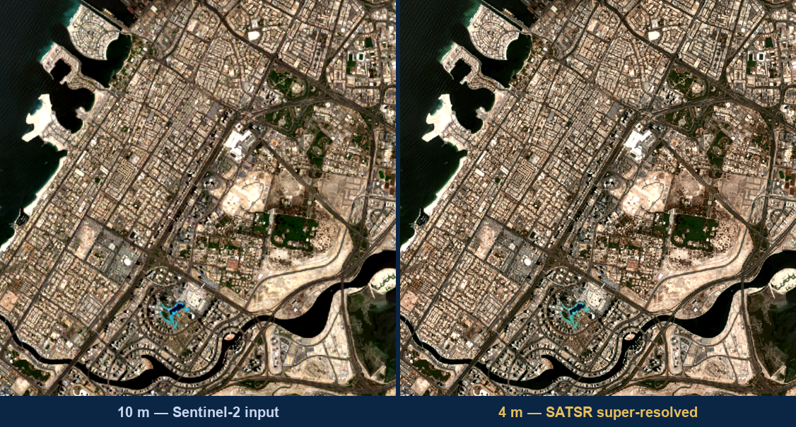
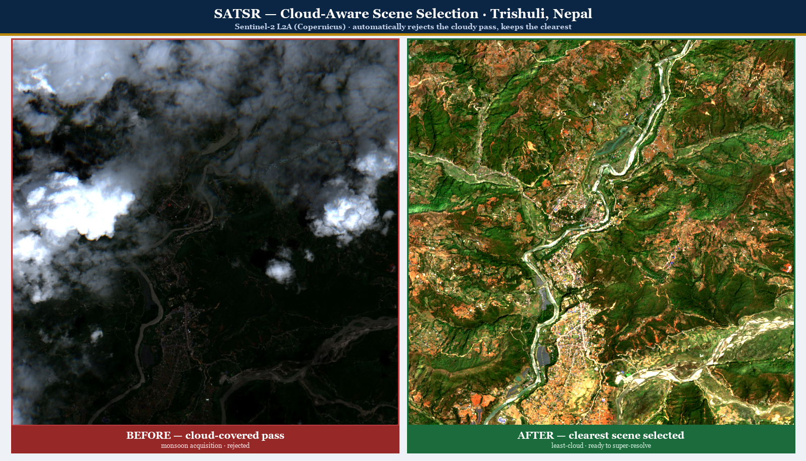
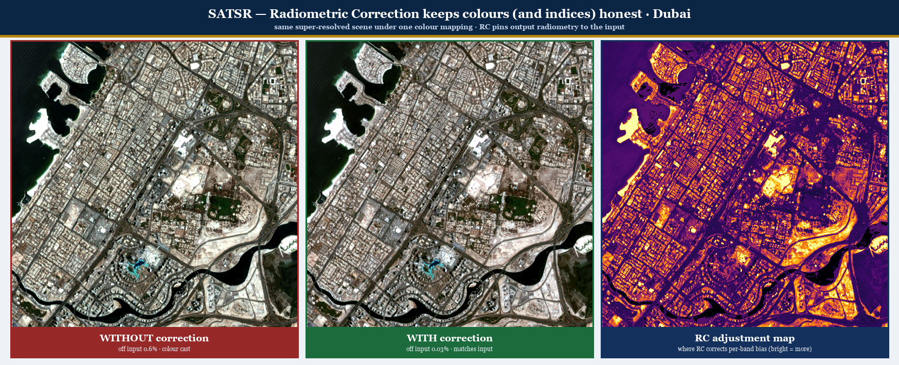
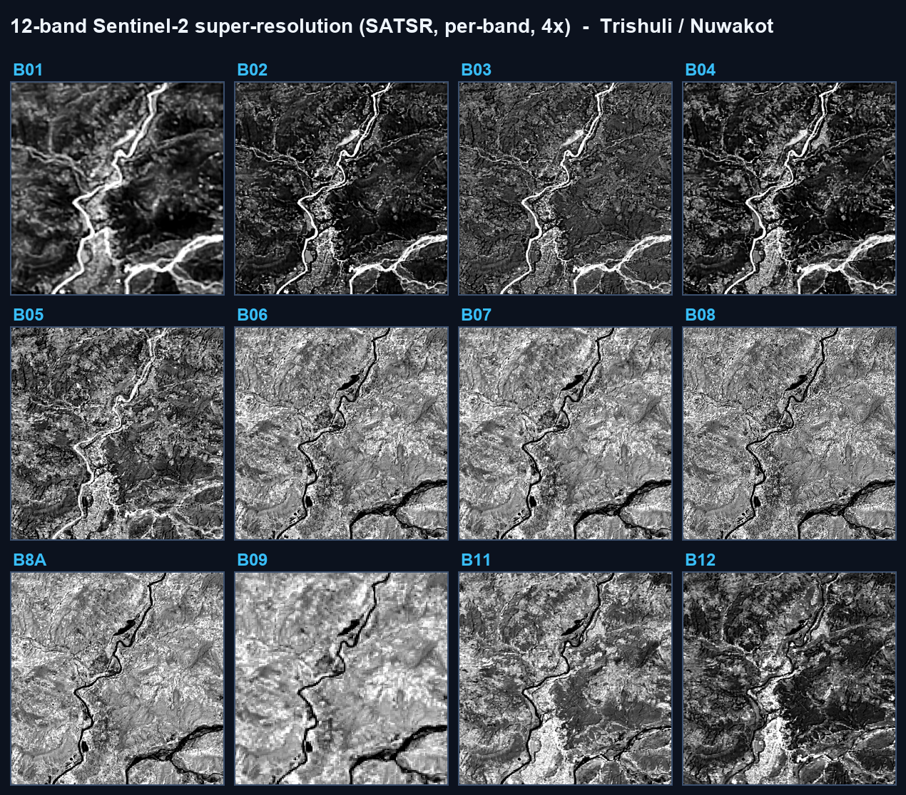
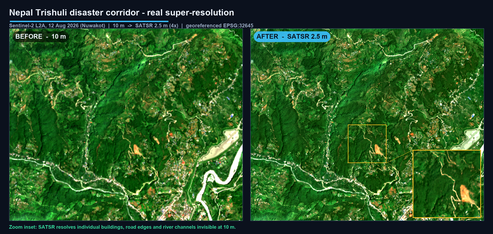

<div align="center">

# 🛰️ SATSR

### Satellite Imagery Super-Resolution & Geospatial Intelligence Platform

**Turning free 10 m Sentinel-2 imagery into sharp, map-accurate 4 m products — georeferenced, spectrally faithful, and uncertainty-aware.**


<br/>



*Left: raw 10 m Sentinel-2. Right: SATSR-enhanced 4 m — Dubai, ingested live from Copernicus.*

</div>

---

## Overview

**SATSR** super-resolves free **Copernicus Sentinel-2** imagery from **10 m → 4 m** (up to 10×) using a generative super-resolution engine (Real-ESRGAN / RRDBNet). Every output is a **georeferenced GeoTIFF** — the CRS and geotransform are preserved so every pixel stays on the map — with an optional **per-pixel uncertainty map** that flags where detail is genuinely observed versus statistically inferred.

Built for **national-scale Earth observation**: it runs on commodity **4 GB GPUs or plain CPU**, uses only free & open data, and costs a fraction of commercial high-resolution imagery.

> Prototype developed for **Smart India Hackathon 2026**. Demonstration system for evaluation — not an official Government of India service.

---

## ✨ Highlights

- **10 m → 4 m super-resolution** (up to 10×), CRS & geotransform preserved
- **Uncertainty-aware** — per-pixel confidence map, not a cosmetic upscale
- **12-band multispectral** — visible, NIR, red-edge & shortwave; NDVI / NDWI / NDBI stay valid
- **Cloud-aware ingest** — automatically selects the clearest available scene
- **Radiometric correction** — output spectra pinned to the input, so colours stay honest
- **Sovereign & lightweight** — INT8-compressed (SSIM 0.998), 4 GB GPU or CPU, offline-capable
- **Live ingest** — draw an area, enter coordinates (decimal or DMS), or pick a preset
- **Web portal + FastAPI backend** — before/after slider, Leaflet map, downloadable GeoTIFF

---

## 🎯 Key Capabilities

### Cloud-aware scene selection
SATSR rejects the cloud-covered pass and keeps the clearest Sentinel-2 acquisition for an area — no manual scene hunting.



### Radiometric correction — colours (and indices) stay honest
The output radiometry is pinned back to the input per band, so spectral indices remain scientifically valid. The map on the right shows where the correction acts.



### 12-band multispectral super-resolution
Every band is super-resolved — not just RGB — enabling full-detail vegetation, water and built-up indices.



### Disaster response
Free Sentinel-2 sharpened to 4 m the same day — river channels, roads and settlements mapped for relief planning at zero imagery cost.



---

## 🌍 Who it's for

Built for **NTRO and strategic users**, and useful to every mission that relies on Sentinel-2 but finds 10 m too coarse:

| Domain | Use case |
|---|---|
| **Disaster response** | Floods, landslides, GLOFs mapped within the satellite pass |
| **Border & infrastructure** | Change detection over frontier sectors and strategic sites |
| **Agriculture** | Field-scale crop health for MSP & crop-insurance verification |
| **Water & forests** | Reservoirs, river migration, deforestation monitoring |
| **Urban & coastal** | Unauthorised construction, city growth, coastline change |

---

## 🏗️ How it works

1. **Ingest** a Sentinel-2 scene or map area — live from Copernicus (Sentinel Hub / CDSE / AWS STAC).
2. **Preprocess** — convert to surface reflectance; tile the scene with overlap for seam-free processing.
3. **Super-resolve** each tile; an 8× test-time-augmentation ensemble yields the estimate **and** its per-pixel uncertainty.
4. **Radiometric correction** pins output spectra to the input.
5. **Stream** every tile into a georeferenced GeoTIFF, ready for GIS.

---

## ⚡ Quick start

```bash
# 1. install (Python 3.11+)
pip install -r requirements.txt

# 2. add Copernicus Sentinel Hub OAuth credentials (never committed)
#    create copernicus.env with:
#       client id: <your-client-id>
#       client secret: <your-client-secret>

# 3. run the web app
python run_web.py
#    -> open http://127.0.0.1:8700
```

Model weights are not stored in the repo (large); place your `.pth` under `weights/` or set `SATSR_WEIGHTS`.

---

## 🧠 Tech stack

`PyTorch` · `Real-ESRGAN / RRDBNet` · `rasterio` · `GDAL` · `OpenCV` · `scikit-image` · `FastAPI` · `Leaflet` · `Sentinel Hub API` · `Copernicus CDSE` · `AWS Earth Search (STAC)` · `INT8 quantization` · `GeoTIFF / GeoJSON`

---

## 📊 Performance

| Metric | Value |
|---|---|
| Resolution | 10 m → 4 m (2.5–10×) |
| PSNR (vs reference) | ~42 dB |
| INT8 vs full precision | SSIM 0.998 |
| Model compression | 3.9× (67 → 17 MB) |
| Peak VRAM (demo scene) | ~2.6 GB |
| Live ingest | ~5 s (Sentinel Hub) |

---

## 📚 Research basis

- Wang et al., **Real-ESRGAN** — arXiv:2107.10833
- Wang et al., **ESRGAN (RRDB)** — arXiv:1809.00219
- Lanaras et al., **Super-resolution of Sentinel-2 images** — arXiv:1803.04271
- Razzak et al., **Multi-Spectral SR of Sentinel-2 with Radiometric Consistency** — arXiv:2111.03231
- Adapa et al., **Uncertainty Estimation for Super-Resolution using ESRGAN** — arXiv:2412.15439
- Ghosal et al., **FLNet: Flood-Induced Damage Assessment via SR** — arXiv:2601.03884

---

<div align="center">

**SATSR** — free 10 m in → trustworthy, georeferenced 4 m out · with a confidence map · on sovereign hardware · at near-zero cost.

</div>
